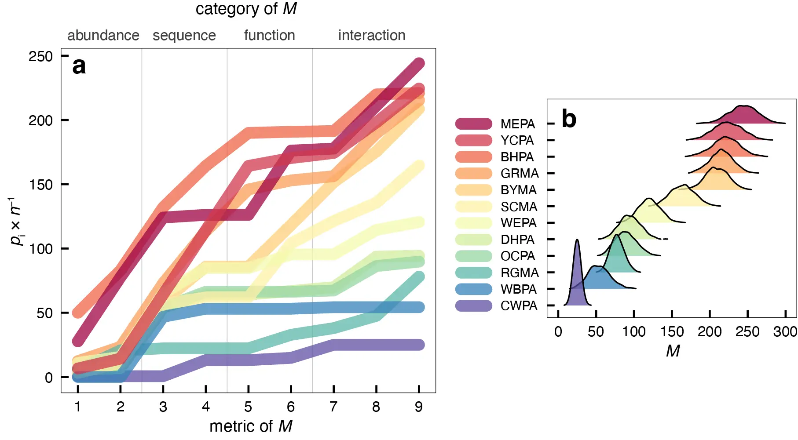
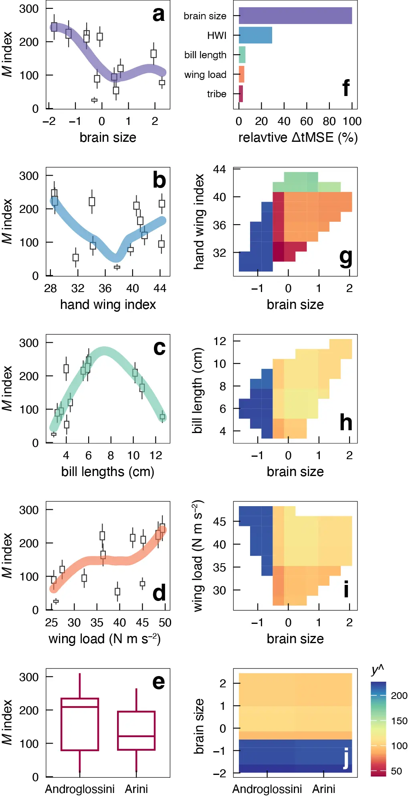

# colpa_flock

**Social activity of mixed-species parrot societies foraging at clay cliffs in Perú**

[](https://doi.org/10.1093/beheco/araf066)
[](https://doi.org/10.5061/dryad.j0zpc86sp)
[](LICENSE)
[](https://www.r-project.org/)

Data wrangling, analysis, and visualization behind *Species cumulative impacts to
mixed assemblages of Neotropical parrots* (Van Houtan et al. 2025, *Behavioral
Ecology*). The project observes 13 species of parrots, macaws, and parakeets foraging
on exposed clay cliffs ("collpas") along the Tambopata River, builds a multivariate
index of each species' social impact on the group, and uses Random Forest models to
identify the taxonomic and morphometric traits that best predict that impact.

The headline result: **relative brain size is the strongest predictor of social
impact** — parrots with smaller brains (controlled for body size) have the highest
impact scores — and the assemblages show a sequenced division of labor in which
subordinate pioneers initiate foraging and dominant sentinels follow.

<p align="center">
  
</p>

---

## Citation

If you use this code or data, please cite the paper and the archived dataset.

**Paper**

> Van Houtan KS, Rojas-Moscoso JI, Van Houtan HN, Gonzalez O. 2025. Species
> cumulative impacts to mixed assemblages of Neotropical parrots. *Behavioral
> Ecology* 36(4):araf066. https://doi.org/10.1093/beheco/araf066

**Dataset (Dryad)**

> Van Houtan KS, Rojas-Moscoso JI, Van Houtan HN, Gonzalez O. 2025. Data from:
> species cumulative impacts to mixed assemblages of Neotropical parrots.
> *Behavioral Ecology* [dataset]. https://doi.org/10.5061/dryad.j0zpc86sp

<details>
<summary>BibTeX</summary>

```bibtex
@article{vanhoutan2025colpa,
  title   = {Species cumulative impacts to mixed assemblages of Neotropical parrots},
  author  = {Van Houtan, Kyle S. and Rojas-Moscoso, Jose-Ignacio and
             Van Houtan, Hope N. and Gonzalez, Oscar},
  journal = {Behavioral Ecology},
  volume  = {36},
  number  = {4},
  pages   = {araf066},
  year    = {2025},
  doi     = {10.1093/beheco/araf066}
}

@dataset{vanhoutan2025colpadata,
  title     = {Data from: species cumulative impacts to mixed assemblages of
               Neotropical parrots},
  author    = {Van Houtan, Kyle S. and Rojas-Moscoso, Jose-Ignacio and
               Van Houtan, Hope N. and Gonzalez, Oscar},
  publisher = {Dryad},
  year      = {2025},
  doi       = {10.5061/dryad.j0zpc86sp}
}
```
</details>

---

## Repository structure

```
colpa_flock/
├── data/                  # all input + intermediate data (CSV)
├── script/                # numbered R analysis pipeline (0 → 7)
├── viz/                   # exported figure PDFs (working drafts + finals)
├── Fig6.webp              # preview: social impact index (manuscript Fig 6)
├── Fig8.webp              # preview: Random Forest results (manuscript Fig 8)
├── colpa_flock.Rproj      # RStudio project (sets working dir to repo root)
├── LICENSE                # MIT
└── README.md
```

Scripts read data with **paths relative to the repository root** (e.g.
`read.csv('data/flush.csv')`). Open `colpa_flock.Rproj` in RStudio — or `setwd()` to
the repo root — before running anything, so those relative paths resolve.

---

## The analysis pipeline

The eight scripts are numbered in execution order. Scripts `0`–`4` and `6` are
largely independent (each reads from `data/` and renders one manuscript figure).
Scripts `5` and `7` build the social-impact index and the Random Forest models and
are the analytical core. Each script is self-contained: it loads its own libraries,
defines the shared `themeKV` ggplot theme, reads the data it needs, and assembles its
panels with **patchwork**.

| Script | Builds | What it does |
| --- | --- | --- |
| `0_colpa_flock.R` | Fig 1g–h | Dawn-flock abundance and species richness as a function of foraging duration (boxplots + LOESS over 5-min survey intervals). |
| `1_colpa_sumstats.R` | Fig 2 | Daily event chronology (dawn → first call → dance → first landing → group end), bout/dance/dawn-to-dance durations, the dawn↔dance linear model (R² = 0.77), and monitoring effort across days and hours. |
| `2_colpa_surveys.R` | Fig 3 | Tidies raw counts, filters to mixed-species flocks, and maps species abundance through the day in both biomass (kg hr⁻¹ day⁻¹) and individuals, separating dawn vs. daytime foragers. Writes `data/lilDF.csv`. |
| `3_colpa_timing.R` | Fig 4 | Dawn-flock chronology on rescaled relative time; extracts each species' LOESS abundance peak to order arrivals, and tabulates pioneer ("first to land") species. Writes `data/loess_max2.csv`. |
| `4_flush_fights.R` | Fig 5 | Flush frequency and causes (anthropogenic vs. natural), sentinel alarm counts by species, and agonistic interactions — interaction rate, breadth, and a displacement (dominance) hierarchy. |
| `5_sociality.R` | Fig 6 | Assembles the nine index components into the cumulative social-impact index **M**, then runs the non-parametric bootstrap (2,000 replicates) to generate robust per-species distributions. |
| `6_morphs.R` | Fig 7 | Explores museum morphometrics: hand-wing index (dispersal), culmen + mandible length (dominance), wing loading (flight), and the brain-volume ~ body-mass power model whose residuals proxy cognition. Includes a recorder-effect QC check. |
| `7_RF.R` | Fig 8 | Trains, tunes, and runs the Random Forest regressions of M on taxonomic/morphometric covariates; produces variable-importance rankings, raw pairwise relationships, two-way partial-dependence plots, and the tribe-split sensitivity models. |

<p align="center">
  
</p>

---

## The social impact index (M)

For each species, group impact `M` accumulates **nine metrics** across four
categories, each rescaled 0–100 and equally weighted so each category contributes a
maximum of 100 and `M` maxes at 400:

| # | Metric | Category | Description |
| --- | --- | --- | --- |
| 1 | biomass | abundance | aggregate bird biomass (kg hr⁻¹ day⁻¹), effort-corrected |
| 2 | individuals | abundance | aggregate number of birds (birds hr⁻¹ day⁻¹), effort-corrected |
| 3 | full-day | chronology | daily hour of peak abundance, rescaled to hours after dawn |
| 4 | dawn-flock | chronology | time of peak LOESS abundance within the dawn aggregation |
| 5 | pioneer | function | times the species led the pioneer "dance" cohort |
| 6 | sentinel | function | times the species gave a group-flushing alarm call |
| 7 | displacement rate | interaction | wins ÷ total agonistic interactions (social status) |
| 8 | interaction rate | interaction | agonistic interactions ÷ individual abundance |
| 9 | interaction breadth | interaction | number of species interacted with agonistically |

A non-parametric bootstrap (`set.seed(916)`, 2,000 replicates, sampling the 9
components with replacement) yields a statistically robust per-species `M`
distribution. The same bootstrapped series becomes the response variable for the
Random Forest models in `7_RF.R`.

**Random Forest setup.** A full model on 10 covariates is reduced — without loss of
performance — to five independent predictors: `BEAK_cmsl`, `WING_load`, `WING_hwi`,
`BRAIN_Yres`, and `TRIBE`. Models use `ntree = 2000`, `mtry` tuned over the candidate
range, and 10-fold cross-validation repeated 5×. The final model reaches **R² ≈
0.96**, ranking relative brain size ahead of hand-wing index, bill length, wing load,
and tribe. Tribe-split post-hoc models confirm brain size stays top-ranked within
both Arini and Androglossini.

---

## Data dictionary

All files live in `data/`. Sizes below are data rows (excluding the header).

**Primary / field data**

| File | Rows | Contents |
| --- | --- | --- |
| `survey_talldb0.csv` | 24,296 | Full raw tall survey database: per-species counts at each timestamp, with dawn-relative time, mass, and effort-corrected duration fields. |
| `survey_talldb.csv` | 5,589 | Cleaned tall survey database (mixed-species records) used by most survey plots. |
| `colpa_raw.csv` | 1,877 | Wide-format raw counts (one column per species) per survey row. |
| `collpa_activity.csv` | 72 | One row per monitored day: dawn, first call, dance, first landing, group end, plus dance and foraging durations. |
| `monitor_hours.csv` | 98 | Observer effort per day × half-hour bin (05:00–17:00). |
| `flush.csv` | 1,199 | Flush events with timestamp, type, cause, anthropogenic/natural category, and alarming sentinel species. |
| `museo_morphs.csv` | 1,344 | Long-format museum specimen measurements (HWI, culmen/mandible, etc.) across 8 collections. |
| `museo_morphs2.csv` | 334 | Wide-format wing and bill measurements with `RECORDER` field for QC. |
| `first_down.csv` | 78 | Pioneer record: which species was first to land each day. |

**Derived / intermediate** (regenerated by the scripts)

| File | Rows | Contents |
| --- | --- | --- |
| `lilDF.csv` | 5,590 | Gathered mixed-species counts written by `2_colpa_surveys.R`. |
| `survey_histogr.csv` | 1,883 | Summarized abundance histogram by species × dawn-relative hour. |
| `duration_relative_t.csv` | 310 | Per-species abundance on rescaled relative time, for dawn chronology. |
| `loess_max2.csv` | 12 | Per-species LOESS abundance-peak times, written by `3_colpa_timing.R`. |
| `fights.csv` | 10 | Per-species agonistic-interaction summary (rate, breadth, win rate). |
| `displacement.csv` | 70 | Pairwise win/loss displacement matrix with rates and dominance order. |

**Species-level inputs to the index & models**

| File | Rows | Contents |
| --- | --- | --- |
| `body_brain.csv` | 10 | Body mass (g) and brain volume (ml) per species. |
| `covars.csv` | 10 | RF covariates: `TRIBE`, `GENUS`, `MASS`, `BEAK_cmsl`, `WING_hwi`, `WING_twai`, `WING_load`, `BRAIN_ml`, `BRAIN_Yres`. |
| `sociality.csv` | 10 | The nine index components per species (used for the bootstrap). |
| `sociality2.csv` | 10 | Index components per species (cumulative line-plot variant). |
| `weights.csv` | 7 | Category weights available to the bootstrap (an optional weighting scheme). |

Covariate definitions: `BEAK_cmsl` = cumulative culmen + mandible straight length
(cm); `WING_hwi` = hand-wing index (dispersal); `WING_twai` = total wing area index;
`WING_load` = wing loading (N m s⁻²); `BRAIN_ml` = brain volume (ml); `BRAIN_Yres` =
residual from the brain~body power fit (cognitive proxy).

---

## Species codes

The analysis covers 11 species plus one small-macaw complex (`GRMA`).

| Code | Common name | Scientific name |
| --- | --- | --- |
| MEPA | Mealy amazon | *Amazona farinosa* |
| YCPA | Yellow-crowned amazon | *Amazona ochrocephala* |
| BHPA | Blue-headed parrot | *Pionus menstruus* |
| WBPA | White-bellied parrot | *Pionites leucogaster* |
| OCPA | Orange-cheeked parrot | *Pyrilia barrabandi* |
| WEPA | White-eyed parakeet | *Psittacara leucophthalmus* |
| DHPA | Dusky-headed parakeet | *Aratinga weddellii* |
| CWPA | Cobalt-winged parakeet | *Brotogeris cyanoptera* |
| RGMA | Red-and-green macaw | *Ara chloroptera* |
| BYMA | Blue-and-yellow macaw | *Ara ararauna* |
| SCMA | Scarlet macaw | *Ara macao* |
| GRMA | Small-macaw complex | *Ara severus* (CFMA) + *Orthopsittaca manilatus* (RBMA) |

`CFMA` and `RBMA` were indistinguishable while foraging and are lumped as `GRMA`.
`DBPA` (dusky-billed parrotlet, *Forpus modestus*) appears in the raw data but is
filtered out, as it occurred only in monospecific flocks.

---

## Requirements

- **R ≥ 4.2** (analyses were run on R 4.2.2, macOS, Apple M1)
- The packages below

```r
install.packages(c(
  # data wrangling
  "dplyr", "tidyr", "tidyverse", "data.table", "zoo", "lubridate",
  "broom", "magrittr", "plyr", "reshape",
  # visualization
  "ggplot2", "ggthemes", "ggridges", "patchwork", "RColorBrewer",
  "colorspace", "scales", "forcats", "ggrepel", "ggpubr", "gridExtra",
  # modeling
  "caret", "randomForest", "pdp", "infer",
  # parallel backend (RF)
  "doParallel"
))
```

> Note: `plyr` and `reshape` are legacy holdovers. Load order matters in places —
> e.g. `7_RF.R` deliberately avoids attaching `plyr` so that `dplyr::rename()` resolves
> correctly inside the partial-dependence loop.

---

## Reproducing the analysis

1. **Clone** the repository.
   ```bash
   git clone https://github.com/vanhoutan/colpa_flock.git
   cd colpa_flock
   ```
2. **Open** `colpa_flock.Rproj` in RStudio (this sets the working directory to the
   repo root, which the relative data paths depend on).
3. **Install** the packages above.
4. **Run** the scripts in numerical order (`0` → `7`). Each renders its manuscript
   figure as a composited patchwork plot. Scripts `0`–`4` and `6` can also be run
   individually; `5` and `7` build the index and the models.

### Reproducibility notes

- **Seeds.** Stochastic steps fix seeds for exact reproducibility — the bootstrap and
  RF training both use `set.seed(916)`, with additional seeds (`0819`, `080402`) on
  the fitted forests.
- **One absolute path.** `3_colpa_timing.R` writes `loess_max2.csv` to a hard-coded
  local path (`/Users/kylevanhoutan/...`). That output is already committed under
  `data/`, so downstream scripts run fine; only edit that one `write.csv()` line if
  you want to regenerate it on your own machine.
- **Exploratory by design.** The scripts often build several candidate versions of a
  panel (alternate palettes, faceted vs. ridgeline, etc.) before the final layout.
  The last `patchwork` layout block in each script assembles the published figure;
  earlier `pX` objects are working drafts.
- **Figure exports.** `viz/` holds the working and final PDF exports; final panels
  were composited and lightly post-processed (e.g. in Illustrator) for the manuscript.

---

## License

Released under the **MIT License** — see [`LICENSE`](LICENSE). © 2023 Kyle Van Houtan.

---

## Authors

- **Kyle S. Van Houtan** — conceptualization, project admin, contributed data, analysis, and code ([@vanhoutan](https://github.com/vanhoutan))
- Jose-Ignacio Rojas-Moscoso — conceptualization, contributed data
- Hope N. Van Houtan — contributed data
- Oscar Gonzalez — conceptualization, contributed data

Field monitoring along the Tambopata River was carried out through a collaboration
among an indigenous community, an ecotourism enterprise (Rainforest Expeditions), and
academic partners. Museum morphometrics drew on specimens from eight ornithology
collections. See the paper's Acknowledgments for the full list of contributors and
supporting institutions.
